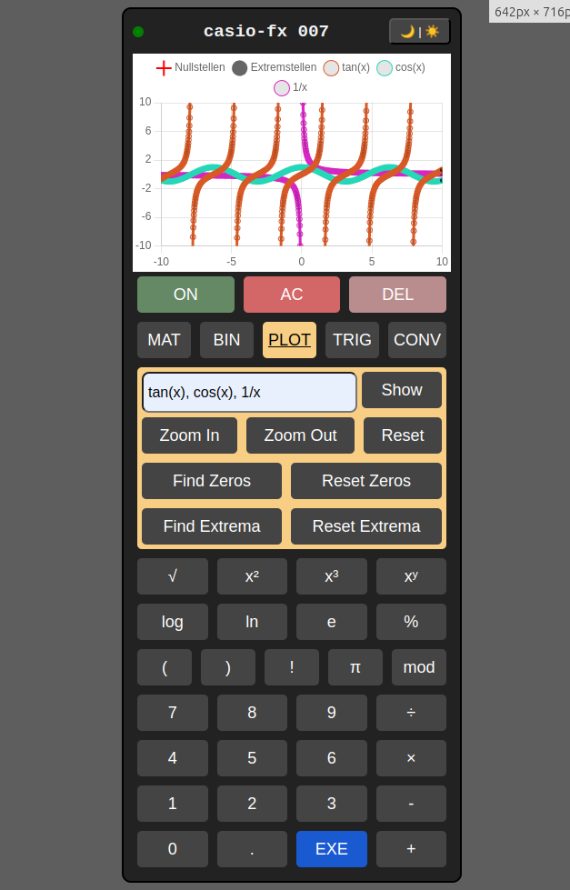

# 📊 Grafischer Taschenrechner

Ein vielseitiger, browserbasierter grafischer Taschenrechner in **JavaScript**, der komplexe mathematische Operationen einfach und interaktiv macht.

## ✨ Funktionen

- **Standardberechnungen**  
  Grundrechenarten, Potenzen, Wurzeln, Prozentrechnungen und mehr.

- **Matrizenberechnung**  
  Addition, Subtraktion, Multiplikation und Determinanten von Matrizen.

- **Binärrechner**  
  Umrechnung und Rechenoperationen im Binär-, Octal- und Hexadezimalsystem.

- **Funktionsplotter**  
  Visualisierung mathematischer Funktionen mit:
  - Nullstellenberechnung
  - Extrempunkten
  - Monotonieuntersuchung
  - Zoomen und Verschieben des Graphen

- **Trigonometrische Berechnungen**  
    * sin, cos, tan
    * sin⁻¹, cos⁻¹, tan⁻¹

- **Maßeinheiten-Umrechner**  
  Einheitenumrechnung (z. B. Länge, Gewicht, Temperatur).

---

## ⚙️ Verwendete Technologien & Abhängigkeiten

Dieses Projekt nutzt folgende JavaScript-Bibliotheken:

- [Chart.js](https://www.chartjs.org/) – Für die Erstellung der interaktiven Diagramme  
- [chartjs-plugin-zoom](https://www.chartjs.org/chartjs-plugin-zoom/latest/) – Ermöglicht Zoomen und Verschieben der Graphen  
- [Hammer.js](https://hammerjs.github.io/) – Gestensteuerung für Touchgeräte  
- [math.js](https://mathjs.org/) – Leistungsfähige mathematische Bibliothek  
- [jQuery](https://jquery.com/) – DOM-Manipulation und Event-Handling

### 📦 Eingebundene CDNs

```html
<script src="https://cdn.jsdelivr.net/npm/chart.js"></script>
<script src="https://cdnjs.cloudflare.com/ajax/libs/hammer.js/2.0.8/hammer.min.js"></script>
<script src="https://cdn.jsdelivr.net/npm/chartjs-plugin-zoom"></script>
<script src="https://cdn.jsdelivr.net/npm/mathjs@12/lib/browser/math.js"></script>
<script src="https://ajax.googleapis.com/ajax/libs/jquery/3.7.1/jquery.min.js"></script>
```


### 🖥️ Screenshot


